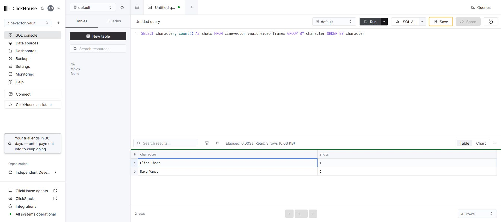

# ClickHouse Runtime Smoke Test Evidence

**Date:** 2026-08-21

This document records both the original self-hosted proof and the final managed ClickHouse Cloud verification.

## Architecture Distinction
- **Verified Status**: Official `mcp-clickhouse` runtime execution against ClickHouse Cloud (Version 26.2.1.558) via secure HTTPS is **PASS**.
- **Earlier Proof**: The same official MCP path also passed against a disposable self-hosted ClickHouse 25.8.31.9 cluster.
- **Managed Service**: `cinevector-vault`, Mumbai region, created from the hackathon's official ClickHouse credit link.
- **Visual Evidence**: `clickhouse-cloud-query.jpg` shows the managed SQL console returning the same two-character result from three reference rows.

## Reproducible Procedure (Secret-Free)

1. **Start Self-Hosted ClickHouse:**
   Launch a local ClickHouse server instance on the standard HTTP port (8123).
   ```bash
   docker run -d -p 8123:8123 -e CLICKHOUSE_USER=default -e CLICKHOUSE_PASSWORD="<PLACEHOLDER_PASSWORD>" --name clickhouse-server --ulimit nofile=262144:262144 clickhouse/clickhouse-server:25.8
   ```
   *(Observed server version during proof: 25.8.31.9)*

2. **Database Initialization:**
   Create the `cinevector_vault` database and the `video_frames` table, inserting the three reference rows.
   ```sql
   CREATE DATABASE IF NOT EXISTS cinevector_vault;
   CREATE TABLE cinevector_vault.video_frames (
       shot_id String,
       scene Int32,
       character String,
       costume String,
       lighting String
   ) ENGINE = MergeTree() ORDER BY shot_id;

   INSERT INTO cinevector_vault.video_frames (shot_id, scene, character, costume, lighting) VALUES
   ('TAKE-101_REF', 1, 'Maya Vance', 'Charcoal cyber trenchcoat, matte collar', 'Cyan key, magenta rim'),
   ('TAKE-102_REF', 1, 'Maya Vance', 'Charcoal cyber trenchcoat, rain droplets', 'Cyan anamorphic flare'),
   ('TAKE-201_REF', 2, 'Elias Thorn', 'White biometric lab coat, silver trim', 'Crimson strobe light');
   ```

3. **Run MCP Query Validation:**
   Export the required environment variables pointing to your local cluster.
   ```bash
   export CLICKHOUSE_HOST="127.0.0.1"
   export CLICKHOUSE_PORT="8123"
   export CLICKHOUSE_USER="default"
   export CLICKHOUSE_PASSWORD="<PLACEHOLDER_PASSWORD>"
   export CLICKHOUSE_SECURE="false"
   ```
   Execute the verification script to run the official `mcp-clickhouse` server over stdio through the Python MCP ClientSession.
   ```bash
   python scripts/verify_clickhouse_mcp.py
   ```

## Verified Execution Result

- **Query Executed:** `SELECT character, count() AS shots FROM video_frames GROUP BY character ORDER BY character`
- **Project Response Mode:** Live
- **Evidence Source:** `mcp-clickhouse` Official Live MCP Stdio Session
- **Final Cluster:** ClickHouse Cloud 26.2.1.558 over secure port 8443

**Output:**
```
character       shots
Elias Thorn     1
Maya Vance      2
```


