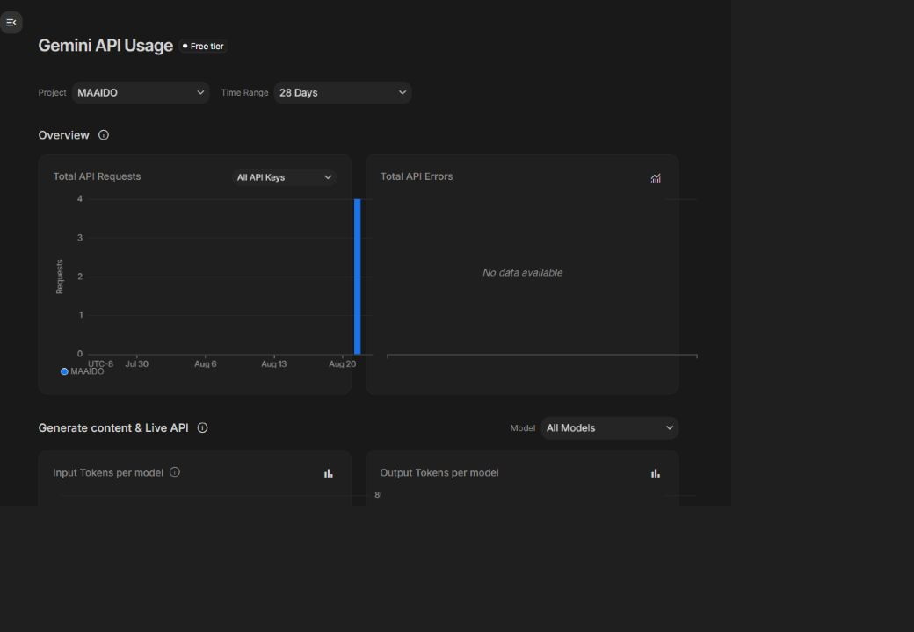

# Gemini Runtime Smoke Test Evidence

**Date:** 2026-08-21

This document records a dated smoke observation of the Gemini API runtime. This is an observation of a successful execution run, never to be interpreted as a general performance claim.

## Verified Execution Result

- **Check Type:** Secret-safe authenticated smoke check
- **Model:** `gemini-2.5-flash`
- **Authentication:** Existing Google AI Studio key (key not included)
- **Result:** `mode live`, `success true`
- **Output:** Returned the expected structured `continuity-token` fields
- **Observed Latency:** 4344 ms

## Usage Evidence

The privacy-cropped Google AI Studio usage screenshot shows four successful requests with no API errors. 

*Note: The usage proof does not claim which request belongs to which track.*
